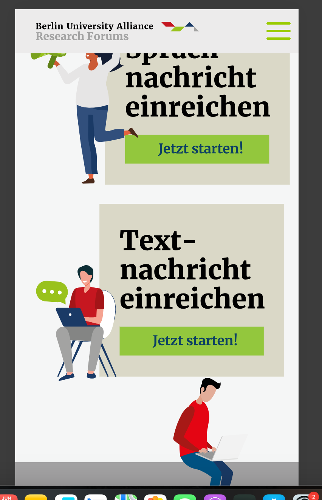
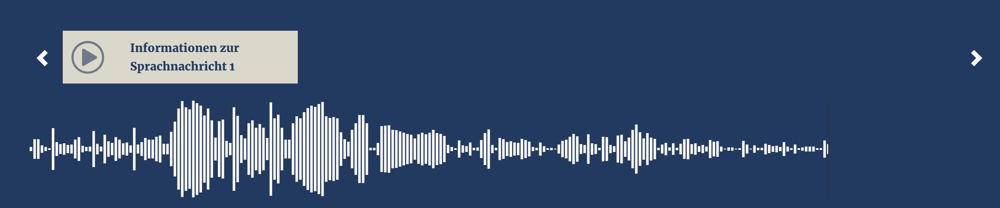
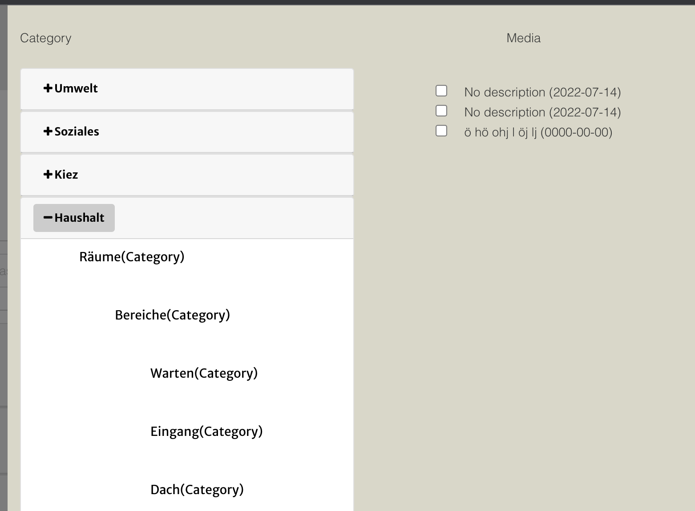
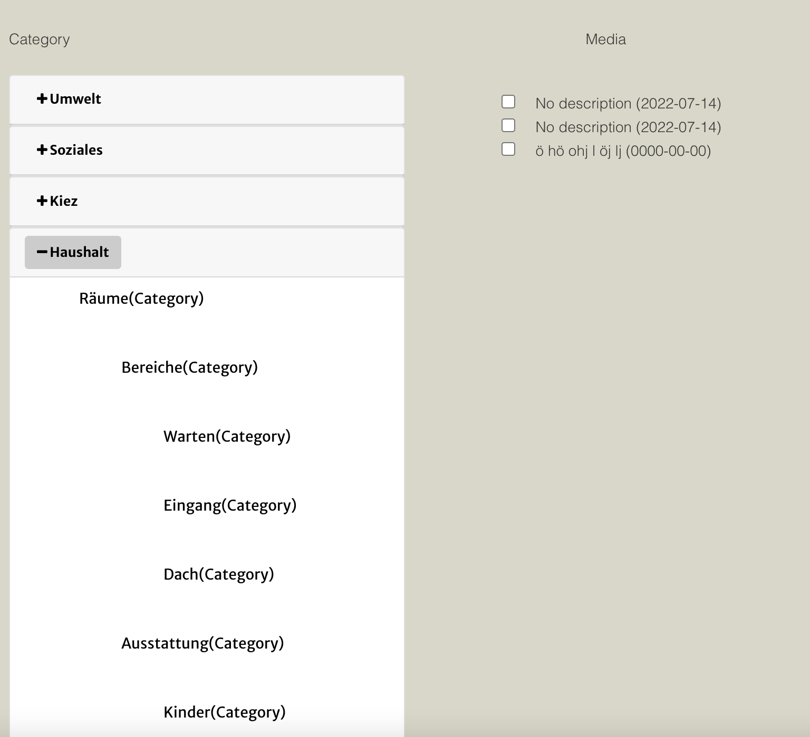
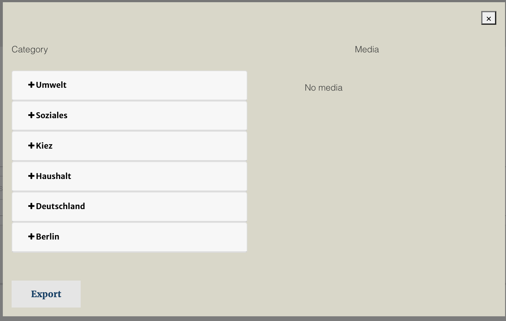

# Laravel

A modern and scalable web application built with [Laravel](https://laravel.com/), the PHP framework for web artisans. This project is structured for clean development, extensibility, and high performance.

The website knowledge-exchange.berlin-university-alliance.de serves as a platform for the Berlin University Alliance's initiative to promote multidirectional knowledge exchange between academia and society. It focuses on integrating societal perspectives into research to address pressing urban and global challenges.

## 🚀 Features

- 🛠️ Laravel 10+ support
- 🔐 User Authentication & Authorization
- 📦 Modular Architecture (Controllers, Services, Repositories)
- 📃 RESTful API support with Laravel Resources
- 🌐 Multi-language support (optional)
- 🧾 Validation using Form Requests
- 📊 Admin dashboard (e.g., Laravel Nova or custom)
- 🗃️ Database migrations and seeders
- 📬 Email Notifications (e.g., Registration, Orders)
- 🧪 Unit & Feature Tests (PHPUnit)

---

## 🧱 Tech Stack

- PHP 8.x
- Laravel Framework
- MySQL / MariaDB
- Composer
- Redis / Cache (optional)
- Laravel Sanctum / Passport for API Authentication

---

[Visit my website](https://knowledge-exchange.berlin-university-alliance.de/berlinforschtmit/)

## 📸 Screenshot







## ⚙️ Installation

```bash
# Clone the repository
git clone https://github.com/vunamweb/bua_berlinforschtmit
cd project-name

# Install dependencies
composer install

# Copy .env config and generate key
cp .env.example .env
php artisan key:generate

# Configure database in .env

## 📸 Screenshot


# Then run migrations and seeders
php artisan migrate --seed

# Serve the application
php artisan serve

